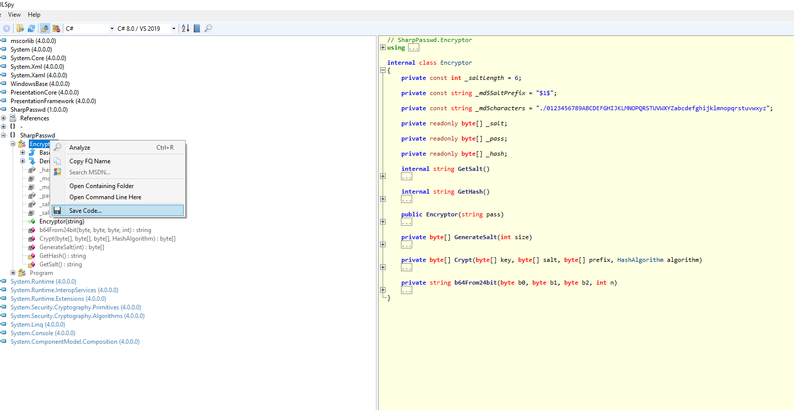
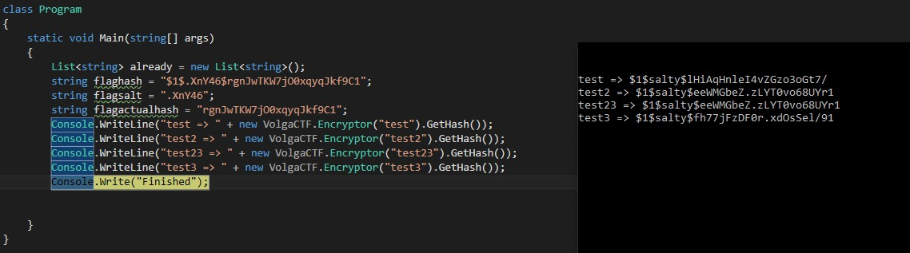
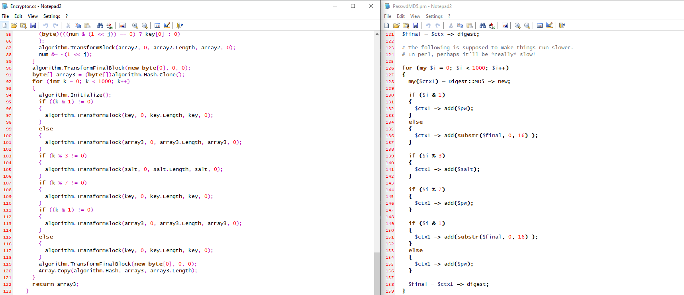
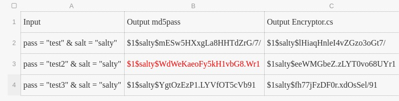

# Sharpasswd

This is a writeup of the CTF Team [JustDoIt](https://ctftime.org/team/35753)

## TL;DR

1. Load into ILSpy to get the decompiled code
2. Find out that the password is limited to 5 chars.
3. Find out that the Sharpasswd-Hash is very similar to the Unix Crypt-Hash and that it can be converted to a Unix Crypt Hash
4. Convert the Sharpasswd-Hash => ```$1$.XnY46$rgnJwTKW7jO0xqyqJkf9C1``` to a Unix Crypt hash => ```$1$.XnY46$LhnB7S4z7gOmPrSjikP3C1```
5. Brute force it with hashcat ``````hashcat -O -m 500 -a 3 hash.txt -1 ?a?a?a?a?a`````` where hash.txt contains ```$1$.XnY46$LhnB7S4z7gOmPrSjikP3C1``` takes ~6 min on a GTX 1070 Ti
6. Flag ```VolgaCTF{#A4_v}```
## Detailed Version
We are provided with the following information:

```
Check out our very handy util SharpPasswd! We use it to hash our passwords all the time, it's the best!!!

Try and see for yourself: just hash the flag and check that the output is "$1$.XnY46$rgnJwTKW7jO0xqyqJkf9C1"!
```

And with a binary with the name [SharpPasswd.dll](https://q.2020.volgactf.ru/files/feef12b6a35ef9ec64a4d52fa922ee3e/SharpPasswd.dll)

As the name SharpPasswd hints at C# we loaded it into [ILSpy](https://github.com/icsharpcode/ILSpy) and extracted the relevant code 
of the Encryptor Class.



Decompiled Class:

```csharp
using System;
using System.Linq;
using System.Security.Cryptography;
using System.Text;

namespace VolgaCTF
{
	public class Encryptor
	{
		private const int _saltLength = 6;

		private const string _md5SaltPrefix = "$1$";

		private const string _md5characters = "./0123456789ABCDEFGHIJKLMNOPQRSTUVWXYZabcdefghijklmnopqrstuvwxyz";

		private readonly byte[] _salt;

		private readonly byte[] _pass;

		private readonly byte[] _hash;

		internal string GetSalt()
		{
			return Encoding.ASCII.GetString(_salt);
		}

		internal string GetHash()
		{
			StringBuilder stringBuilder = new StringBuilder("$1$");
			stringBuilder.Append(Encoding.ASCII.GetString(_salt));
			stringBuilder.Append('$');
			stringBuilder.Append(b64From24bit(_hash[0], _hash[6], _hash[12], 4));
			stringBuilder.Append(b64From24bit(_hash[1], _hash[7], _hash[13], 4));
			stringBuilder.Append(b64From24bit(_hash[2], _hash[8], _hash[14], 4));
			stringBuilder.Append(b64From24bit(_hash[3], _hash[9], _hash[15], 4));
			stringBuilder.Append(b64From24bit(_hash[4], _hash[10], _hash[5], 4));
			stringBuilder.Append(b64From24bit(_hash[11], 0, 0, 2));
			return stringBuilder.ToString();
		}

		public Encryptor(string pass)
		{
			_pass = Encoding.UTF8.GetBytes(pass.Substring(0, Math.Min(5, pass.Length)));
			_salt = GenerateSalt(6);
			_hash = Crypt(_pass, _salt, Encoding.ASCII.GetBytes("$1$"), MD5.Create());
		}

		private byte[] GenerateSalt(int size)
		{
			StringBuilder stringBuilder = new StringBuilder();
			Random random = new Random();
			for (int i = 0; i < size; i++)
			{
				int index = random.Next(0, "./0123456789ABCDEFGHIJKLMNOPQRSTUVWXYZabcdefghijklmnopqrstuvwxyz".Length);
				stringBuilder.Append("./0123456789ABCDEFGHIJKLMNOPQRSTUVWXYZabcdefghijklmnopqrstuvwxyz".ElementAt(index));
			}
			return Encoding.ASCII.GetBytes(stringBuilder.ToString());
		}

		private byte[] Crypt(byte[] key, byte[] salt, byte[] prefix, HashAlgorithm algorithm)
		{
			algorithm.Initialize();
			algorithm.TransformBlock(key, 0, key.Length, key, 0);
			algorithm.TransformBlock(salt, 0, salt.Length, salt, 0);
			algorithm.TransformBlock(key, 0, key.Length, key, 0);
			algorithm.TransformFinalBlock(new byte[0], 0, 0);
			byte[] array = (byte[])algorithm.Hash.Clone();
			algorithm.Initialize();
			algorithm.TransformBlock(key, 0, key.Length, key, 0);
			algorithm.TransformBlock(prefix, 0, prefix.Length, prefix, 0);
			algorithm.TransformBlock(salt, 0, salt.Length, salt, 0);
			for (int i = 0; i < key.Length; i += array.Length)
			{
				algorithm.TransformBlock(array, 0, Math.Min(key.Length - i, array.Length), array, 0);
			}
			int num = key.Length;
			for (int j = 0; j < 31; j++)
			{
				if (num == 0)
				{
					break;
				}
				byte[] array2 = new byte[1]
				{
				(byte)(((num & (1 << j)) == 0) ? key[0] : 0)
				};
				algorithm.TransformBlock(array2, 0, array2.Length, array2, 0);
				num &= ~(1 << j);
			}
			algorithm.TransformFinalBlock(new byte[0], 0, 0);
			byte[] array3 = (byte[])algorithm.Hash.Clone();
			for (int k = 0; k < 1000; k++)
			{
				algorithm.Initialize();
				if ((k & 1) != 0)
				{
					algorithm.TransformBlock(key, 0, key.Length, key, 0);
				}
				else
				{
					algorithm.TransformBlock(array3, 0, array3.Length, array3, 0);
				}
				if (k % 3 != 0)
				{
					algorithm.TransformBlock(salt, 0, salt.Length, salt, 0);
				}
				if (k % 7 != 0)
				{
					algorithm.TransformBlock(key, 0, key.Length, key, 0);
				}
				if ((k & 1) != 0)
				{
					algorithm.TransformBlock(array3, 0, array3.Length, array3, 0);
				}
				else
				{
					algorithm.TransformBlock(key, 0, key.Length, key, 0);
				}
				algorithm.TransformFinalBlock(new byte[0], 0, 0);
				Array.Copy(algorithm.Hash, array3, array3.Length);
			}
			return array3;
		}

		private string b64From24bit(byte b0, byte b1, byte b2, int n)
		{
			StringBuilder stringBuilder = new StringBuilder(string.Empty);
			int num = (b2 << 16) | (b1 << 8) | b0;
			while (n-- > 0)
			{
				stringBuilder.Append("./0123456789ABCDEFGHIJKLMNOPQRSTUVWXYZabcdefghijklmnopqrstuvwxyz"[num & 0x3F]);
				num >>= 6;
			}
			return stringBuilder.ToString();
		}
	}
}

```

Before taking a deeper look into the code we played a bit around with the hash function and could observe that for inputs like ```test2, test23, test234``` resulted in the same output hash.

To be able to observe this behaviour you need to hardcode the salt to ```salty``` and remove the random salt generation.

Which we could then track down to the following line of code:

```_pass = Encoding.UTF8.GetBytes(pass.Substring(0, Math.Min(5, pass.Length)));```

in 

```public Encryptor(string pass)```   


This means the search space for the password dramatically decreased to **5 characters**.
We started brute forcing to see how fast we could solve this.
Assuming a **flag range** from **0x20-0xff** this would mean **7.7 * 10 ^ 9**  entries.
With an 8 core cpu we reached **14.7kH/s** which meant we'd need **~145 hours** for brute forcing this password. 
As the ctf only lasts for 48 hours this approach wasn't really feasible.

We then thought about reimplementing it in C but we estimated a MAXIMUM speedup of ~10 (probably less) so we avoided 
this option for now.

Another theory was that there might be some obvious inefficencies in the Encryptor Code and if we could optimizie them we could get a better brute force time
unfortunately we couldn't find any low hanging fruits. 

We did some further research, we found a few code snippets which looked very similar to the code of ```Encryptor.cs``` . 
Actually the snippets we found implemented the Unix Crypt method.



**Left Side: Encryptor.cs**   vs.      **Right Side: Perl Implementation of Unix Crypt**

So we installed the ```md5pass``` command.

```md5pass``` is a command line utility which you can feed a hash and a salt and it outputs the MD5 Crypt Hash. 

Unfortunately the hashses didn't match the ones of the ```Encryptor.cs``` but we noticed that the last two bytes were the same.
In the image below one can see that the last two characters are the same.


Therefore we thought there might be some subtle changes between the algorithms, (sharpPasswd vs. Unix Crypt), which resulted in a different hash.
And in fact we found that the algorithm is the same up until the byte shifting part.
The byte shifting at the end was different.

This meant that if we were able to reverse the wrong byte shifiting in Encryptor.cs we could convert the Encryptor hash to a legit Crypt Hash.

Why would we want do this ? 

Because then we can leverage existing GPU optimized password recovery tools like hashcat.

We used the following code for converting the Sharpasswd-Hash to the Unix Crypt Hash.

```csharp
static void Main(string[] args) 
{        
        var target = "$1$.XnY46$rgnJwTKW7jO0xqyqJkf9C1";
        var flippedTarget = Flip(target);
        Console.WriteLine("Flipped target: "+ flippedTarget);
}

private static string Flip(string orig) {
    var parts = orig.Split("$");
    var res = "";
    var a = parts[3];
    while (a.Length > 3) {
        var x = a.Substring(0, 4);
        a = a.Substring(4);
        var b = 0;
        for (var i = 0; i < 4; i++) {
            var idx = "./0123456789ABCDEFGHIJKLMNOPQRSTUVWXYZabcdefghijklmnopqrstuvwxyz".IndexOf(x[0]);
            b = b | ((idx & 63) << (i * 6));
            x = x.Substring(1);
        }

        res += B64From24bitCorrect((byte) (b & 0xff), (byte) ((b >> 8) & 0xFF), (byte) ((b >> 16) & 0xFF), 4);
    }

    res += a;

    return parts[0] + "$" + parts[1] + "$" + parts[2] + "$" + res;
}

private static string B64From24bitCorrect(byte b0, byte b1, byte b2, int n)
{
    StringBuilder stringBuilder = new StringBuilder(string.Empty);
    int num = (int) b0 << 16 | (int) b1 << 8 | (int) b2;

    while (n-- > 0) {
        stringBuilder.Append("./0123456789ABCDEFGHIJKLMNOPQRSTUVWXYZabcdefghijklmnopqrstuvwxyz"[num & 63]);
        num >>= 6;
    }

    return stringBuilder.ToString();
}
```

Which outputs the following hash:

```Flipped target: $1$.XnY46$LhnB7S4z7gOmPrSjikP3C1```

After successfull conversion we saved the hash into a file and let hashcat do it's magic. 

 ```hashcat -O -m 500 -a 3 test_hash.txt -1 ?a?a?a?a?a```
 
Explanation:
1. ```-m 500``` corresponds to the unix Crypt Hash. 
2. ```-O```  turns on some optimizations which in our case gave us double the hashrate
3. ```hash.txt``` just contains ```$1$.XnY46$LhnB7S4z7gOmPrSjikP3C1``` (we had to save it in a file otherwise we got some ```bad separator``` errors)
4. ```?a?a?a?a?a``` tells hash cat that the password is 5 chars long 
5. a corresponds to ```a-z``` , ```A-Z```, ```0-9``` and the following special characters ```«space»!"#$%&'()*+,-./:;<=>?@[\]^_`{|}~```


We got around 7.8 MH/s on a Nvidia GTX 1070 Ti . 
After ~6minutes the password was cracked.


```#A4_v```

We then surrounded it with VolgaCTF{} 

FLAG: ```VolgaCTF{#A4_v}```
